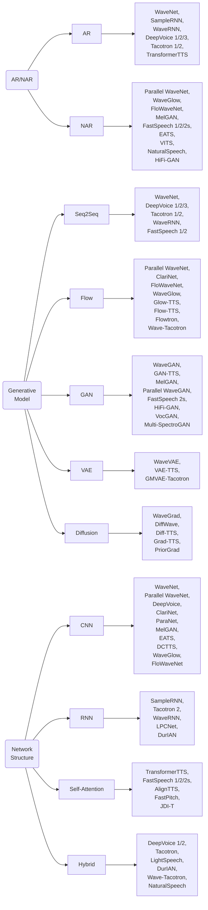

# 1. Introduction

## Motivation

文本转语音合成（Text-to-speech synthesis），简称 TTS 或语音合成（speech synthesis，广义上的语音合成涵盖了从任何信息源生成语音的任务，还包括变声器等。），旨在从文本生成可懂、自然的语音，在使机器能够讲话方面起关键作用，并且是人工智能和自然语言/语音处理中的一项重要任务。

神经 TTS 摒弃了以往 TTS 系统所需的大部分先验知识，纯粹通过数据进行端到端学习。

由于其强大的数据表示学习（representation learning）和数据分布建模（generative modeling）能力，神经 TTS 能够实现与人类录音一样自然的 high voice quality。

## History

### Articulatory Synthesis

调音合成的发声，是通过模拟人类调音器官（articulators），如唇、舌、声门、moving vocal tract 等。

### Formant Synthesis

**共振峰合成**的发声，基于一组规则，来控制简化的源-滤波器（source-filter）模型。这些规则通常是语言学家发展的，用以尽可能地模仿共振峰结构及语音的其他谱属性。语音通过一个**加法合成**（additive synthesis）模块和一个有着可变参数（如基频、voicing、噪声等级）的**声学模型**（acoustic model）来合成。

### Concatenative Synthesis

**拼接合成**依靠存储在数据库中的语音片段的拼接。推理时，拼接 TTS 系统搜索语音片段以匹配给定输入文本，产生一个用这些单元拼接在一起的语音波形（waveform）。

主要有两类拼接语音合成：**双音子合成**（diphone synthesis）和**单元选择合成**（unit selection synthesis）。

**双音子合成**利用描述音素之间过渡的双音子，并在数据库中存储各双音子的单个示例，而**单元选择合成**则利用从整句到单个音素的语音单元，并在数据库中存储每个单元的多个片段。

### Statistical Parametric Synthesis

统计参数语音合成（SPSS），不再直接通过拼接生成波形，而是首先生成对于发声必要的声学参数，然后用一些算法从生成的声学参数中复原语音。

SPSS 通常包括三个组件：一个**文本分析**（text analysis）模块、一个**参数预测**模块（声学模型）、和一个**声码器分析/合成**模块（vocoder）。

**文本分析**模块首先处理文本，包括文本规范化、字音转换（grapheme-to-phoneme conversion, G2P conversion），分词（word segmentation）等。然后提取语言特征（linguistic features），如来自不同粒度（granularities）的音位（phonemes）、词性标签（POS tags）。

**声学模型**，如隐马尔可夫模型（HMM），是用成对的语言特征和参数（声学特征）训练的，其中声学特征包括基频（fundamental frequency）、频谱（spectrum）或倒谱（cepstrum）等，是通过声码器分析从音频中提取的。

**声码器**从预测的声学特征中合成语音。

2010年代，引入深度神经网络，用 DNN、RNN 等替换了 HMM，但遵从 SPSS 的范式，仍然从语言特征中预测声学特征。之后有人提出用音位序列取代语言特征，从中直接生成声学特征，是为第一个有着序列到序列（sequence-to-sequence，简称 seq2seq）框架的基于 encoder-decoder 的 TTS 模型。

TTS 术语“端到端”（end-to-end）意义含混。早期研究中，“端到端”指的是文本到语谱（text-to-spectrogram）的模型是端到端的，但仍然使用一个分开的波形合成器（vocoder）。它也泛指未使用复杂的语言或声学特征的神经 TTS 模型。比如，WaveNet 没用到声学特征，而是直接根据语言特征生成波形。Tacotron 没用到语言特征，而是直接由字符或音位生成语谱（spectrogram）。然而，严格的端到端模型指直接从文本生成波形。因此，我们用“端到端”、“更端到端”（more end-to-end），“完全端到端”（fully end-to-end）来区分 TTS 模型端到端的程度。

## Overview of Neural TTS

### TTS in the Era of Deep Learning

随着深度学习的发展，提出了基于神经网络的 TTS （neural network-based TTS），简称神经 TTS，采用（深度）神经网络作为语音合成的模型骨干。一些早期的神经模型用于 SPSS 以替代 HMM 进行声学建模。后来提出了 WaveNet，直接从语言特征生成波形，可以视为第一个现代神经 TTS 模型。其他模型如 DeepVoice 1/2 仍然遵循统计参数合成中的三个组件，但用相应的基于神经网络的模型进行了升级。

此外，提出了一些端到端模型（如 Char2Wav，Tacotron 1/2，Deep Voice 3 和 FastSpeech 1/2）用以简化文本分析模块，直接以字符/音素序列作为输入，并用梅尔语谱简化声学特征。后来，开发了完全端到端的 TTS 系统，直接从文本生成波形，例如 ClariNet，FastSpeech 2s，EATS 和 NaturalSpeech。与以前基于拼接合成和统计参数合成的 TTS 系统相比，基于神经网络的语音合成的优点包括在可懂度（intelligibility）和自然度（naturalness）方面的 high voice quality，并且对人类预处理和特征开发的要求更少。

### Key Components of TTS

尽管一些端到端模型没有明确使用文本分析（如 Tacotron 2）、声学模型（如 WaveNet）或声码器（如 Tacotron），并且一些系统仅使用单个端到端模型（如 FastSpeech 2s 和 NaturalSpeech），但这些组件的使用仍然流行于当前的 TTS 研究和产品中。

- Chap. 4 文本分析

- Chap. 5 声学模型

- Chap. 6 声码器

- Chap. 7 完全端到端 TTS

### Advanced Topics in TTS

（1）为了改进自然度（naturalness）和表现力（expressiveness），我们引入如何建模、控制和传递风格/韵律（style/prosody）以生成有表现力的（expressive）语音。（Chap. 8）

（2）由于 TTS 模型面临顽健性（robustness）的问题——生成语音中的跳词、重复问题会影响语音质量，我们引入改善语音合成的顽健性的方法。（Chap. 9）

（3）由于神经 TTS 建模成一个 seq2seq 的生成任务，利用深度神经网络作为模型骨干、以自回归的方式生成语音，通常需要更大的推理时间和更高的计算/存储开销。因此，我们引入加速自回归生成及减少模型和计算尺寸的方法。（Chap. 10）

（4）在低数据资源的场景，训练 TTS 模型的数据不充足，合成的语音也许会有较低的可懂度和自然度。因此，我们引入为新的语言和新的说话人构建数据高效（data-efficient）的 TTS 模型的方法。（Chap. 11）

（5）最后，我们简要介绍一些 TTS 之外的任务，包括歌声合成（singing voice synthesis）、声音转换（voice conversion）、语音增强（speech enhancement）和语音分离（speech separation）。（Chap. 12）

### Other taxonomies of TTS

（1）自回归或非自回归

（2）生成式模型：normal sequence generation model, normalizing flows (Flow), generative adversarial networks (GAN), variational auto-encoders (VAE), and denoising diffusion probabilistic models (DDPM or Diffusion)

（3）网络架构：CNN, RNN, self-attention, and hybrid structures (which contain more than one type of structure, such as CNN+RNN, and CNN+self-attention)

### Evolution of Neural TTS

